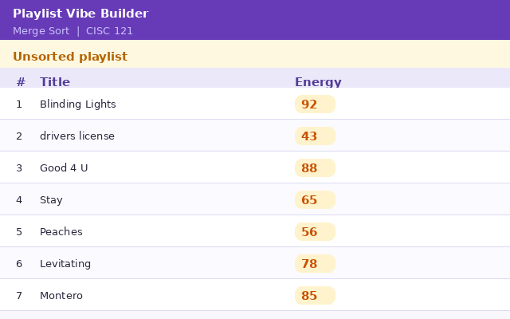

# 🎵 Playlist Vibe Builder

**CISC 121 Project — Queen's University**

---

title: Playlist Vibe Builder
emoji: 🚀
colorFrom: pink
colorTo: purple
sdk: gradio
sdk_version: 6.12.0
app_file: app.py
pinned: false
license: mit
short_description: This is a playlist vibe builder that uses merge sort

---
Check out the configuration reference at https://huggingface.co/docs/hub/spaces-config-reference


## Chosen Problem

The **Playlist Vibe Builder** sorts a list of songs by either energy score (0–100) or duration (seconds), so a listener can arrange their playlist from chill to hype, or shortest to longest.

---

## Chosen Algorithm — Merge Sort

I chose **Merge Sort** because:
- It works reliably on any size list (O n log n time — always)
- It is **stable**, meaning songs with the same energy keep their original order
- Each merge step is easy to show clearly to the user

I implemented the algorithm myself. I did **not** use `sorted()` or `list.sort()` for the core sorting logic.

---

## Demo



---

## Problem Breakdown & Computational Thinking

### Flowchart

```
User picks sort key (energy or duration)
            |
            v
  User clicks "Sort Playlist"
            |
            v
  merge_sort() is called
            |
      len <= 1? --YES--> return list (base case)
            |
            NO
            |
      Split list in half
            |
      Sort left half  (recurse)
      Sort right half (recurse)
            |
      merge() both halves
      (compare front items, pick smaller, repeat)
            |
            v
    Return sorted list
            |
            v
   Show result in table
```

### Four Pillars

**Decomposition**
- Validate input (at least 2 songs)
- Split the list in half
- Recursively sort each half
- Merge two sorted halves by comparing one item at a time
- Display the final table to the user

**Pattern Recognition**
- The merge step always does the same thing: compare the front item of two lists, take the smaller one, advance that pointer. This repeats until both lists are empty.

**Abstraction**
- Show the user: the sorted table, and a step log of each merge
- Hide from the user: recursion depth, indices, how Python stores the list in memory

**Algorithm Design**
```
Input   - list of songs + sort key chosen by user
Process - merge_sort(songs, key_index)
            split → recurse → merge
Output  - sorted table displayed in the app
           step log showing each merge group
```

**Data types used:**
- `list` of `list` — each inner list is one song `[title, artist, energy, duration]`
- `int` — key index (2 for energy, 3 for duration)
- `str` — status message shown to user

---

## Steps to Run Locally

```bash
# 1. Install the python module
pip install gradio

# 2. Run the app
python app.py

# 3. Open your browser at http://127.0.0.1:7860
```

---

## Hugging Face Link

🔗https://huggingface.co/spaces/SaqivW/Playlist_Vibe_Builder/tree/main


---

## Testing

| Test | Input | Expected | Actual | Pass? |
|------|-------|----------|--------|-------|
| Sort by energy | Default playlist | drivers license (43) first, Blinding Lights (92) last | Correct |
| Sort by duration | Default playlist | Montero (137s) first, drivers license (242s) last | Correct |
| Show steps | Either key | Each line shows one merged group | Correct |
| Already sorted | Pre-sorted list | Same order returned | Correct |
| Two songs | 2-item list | Sorted in one merge step | Correct |

**Edge cases tested:**
- A list that is already sorted → returns the same order correctly
- A list of 2 songs → merges in a single step
- Songs with the same energy score → stable, original order preserved

---

## Author & Acknowledgments

- **Author:** [Saqiv Williams] — [20556201]
- **Course:** CISC 121, Queen's University
- **Algorithm reference:** https://visualgo.net/en/sorting
- **UI library:** Gradio — https://gradio.app
- **AI use:** Claude was used for some functions with respect to Gradio.
